# 声明
由于本人能力有限，对引擎只有一个很粗略的了解，以下内容不可避免会出现很多错误，欢迎大佬指出  

分析基于CRYSTALiA的RE:D Cherish!，不同版本可能存在差异  

# vm简述
这个引擎的vm由data.pac中的SCRIPT.SRC和一些.DAT文件构成  
汉化需要关心的最主要文件是其中的SCRIPT.SRC和TEXT.DAT  

SCRIPT.SRC是引擎的核心逻辑脚本，除开前0xC个字节，均属于vm指令，其中开头4字节为文件头，另外8字节未知。  
TEXT.DAT则是一些需要用到的字符串(包括文本)  

.DAT文件(准确来说是文件首字节为0x24('$'))的文件都会经过加密  
解密方式如下
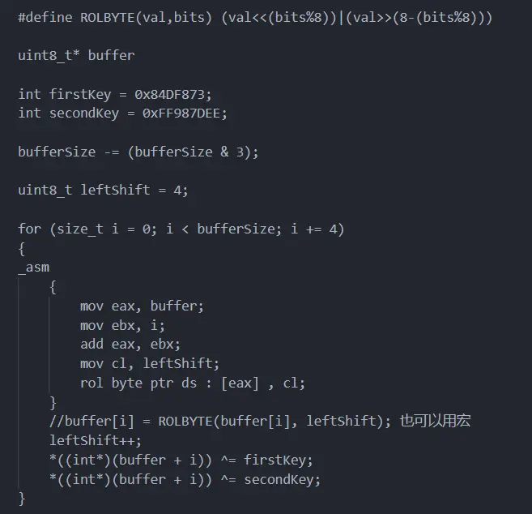

下面以一些常用指令为例进行简略说明  

1F 00 01 00 FF FF FF 0F 

1F 00 01 00为vm的opcode，表示向栈中push一个值。FF FF FF 0F 则为push的值。  

该vm中，push的值大致可以分为常量与变量两种。此处的0x0FFFFFFF代表null，小于0x0FFFFFFF代表push的是一个常量，0x40000000开始则代表一个变量，指令会从变量区中获取值再进行push(实际划分会更细)  

1F 00 01 00 00 00 00 00 1F 00 01 00 49 54 00 00

1F 00 01 00 76 54 00 00 1F 00 01 00 F8 4C 00 00

17 00 01 00 02 00 02 00 00 00 00 00 

前0x20字节代表4次push。17 00 01 00为vm的opcode，代表call。02 00 02 00代表call的具体函数，高位0x02描述了该函数的大致分类，此处为text相关函数，低位0x02代表具体操作，此处为根据参数获取字符串并渲染，同时会获取文本需要调用的语音。最后4字节应该是函数有返回值时需要写入的变量区地址  

1F 00 01 00 F8 4C 00 00 为本条文本需要调用的语音。该值会作为索引从FILE.DAT中寻找要调用的具体文件。具体计算方式为(value<<5)+0x10 

1F 00 01 00 76 54 00 00 为本条文本需要渲染的角色名 

1F 00 01 00 49 54 00 00 为本条文本需要渲染的具体文本 

角色名与渲染文本都是一个TEXT.DAT中的直接偏移  

可以看出0x100??统一为这个vm的opcode，另外还有如0x1000A表示if等，这里就不多做赘述了。最好能了解一下虚拟机，以方便处理出现的各种问题。 

另外还有一点需要注意，vm跳转的方式是通过获得一个POINT.DAT中的索引来获取需要跳转的地址。涉及到具体的opcode索引的计算方式似乎还会有细微差异，最常用的一种应该是[pointDatSize-(value<<2)]+0xC。想添加vm指令的话就需要将所有跳转修正，估计不会很容易。所以要避免翻译把一句话拆成几句话导致需要插入额外的渲染指令。  

# 边界修改

游戏在exe和pal.dll中各有一次边界校验  

exe如下  
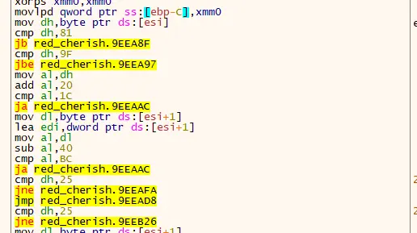  

将0x81,0x9F,0xBC修改为中文编码边界便可  

pal.dll边界如下  
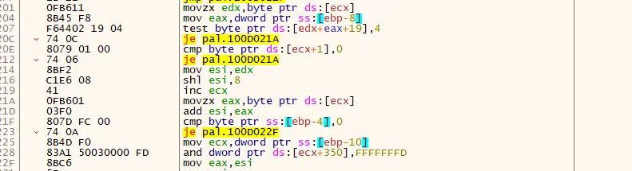  
简单来说程序初始化了一个0xFF大小的表来检测字符编码的高位字节，如果以高位字节为索引获得的值满足value&4!=0,则该字符有两个字节

ida打开会发现其实是用的_mbsnextc  
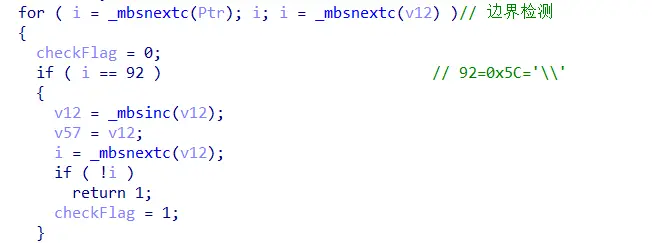  
16进制工具打开pal.dll搜索:  
A6 DF 00 00 00 00 00 00

A1 A5 00 00 00 00 00 00

81 9F E0 FC 00 00 00 00

40 7E 80 FC 00 00 00 00  
修改81 9F和80 FC 两处为中文边界即可  

另外虽然引擎的大部分转义字符都是ascii，但全角空格(0x8140)属于例外。记得要把这个值改成中文编码  
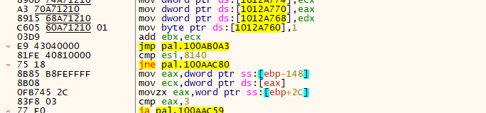  
位置就在pal边界检测的下面一点  

# 渲染模式
这个引擎可以通过字库或者gdi两种方式获取字模  

每次渲染前，程序会调用一次palFontBegin进行检测  
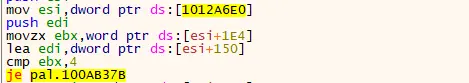  
如果渲染模式的值为4，则会采用字库模式。模式的设置应该是在csv.pac的SYSTEM.INI中(本人并没有试过，直接改了dll)  
游戏初始化时会调用palFontSetType来设置渲染模式，在此更改即可  

如果要使用字库模式，游戏的字库在system.pac的DEFAULT_FONT.DAT中,此游戏还有个额外字库FONT.TGA。不过DEFAULT_FONT.DAT仍是关键字库  
引擎会用字库的编码计算一个偏移，利用改偏移获取到字模在DEFAULT_FONT.DAT中的偏移  
具体计算方式为：((((highByte>>8)-0x80)\*0xFF)+lowByte)\*4  

例如:'少'字的shift_jis编码为8FAD，则(((8F00>>8)-0x80)*0xFF)+0xAD = 0xF9E  
0xF9E*4 = 0x3E78
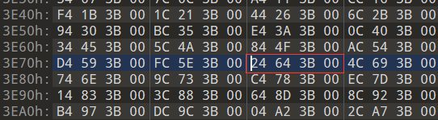  
可以得到实际字模数据在0x3B6424的位置  
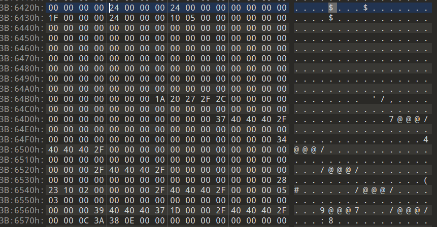  
这里的前0x14字节是一个GLYPHMETRICS，后面4字节是字模数据的大小，随后便是字模(bitMap)  
可以看到字模数据如下  
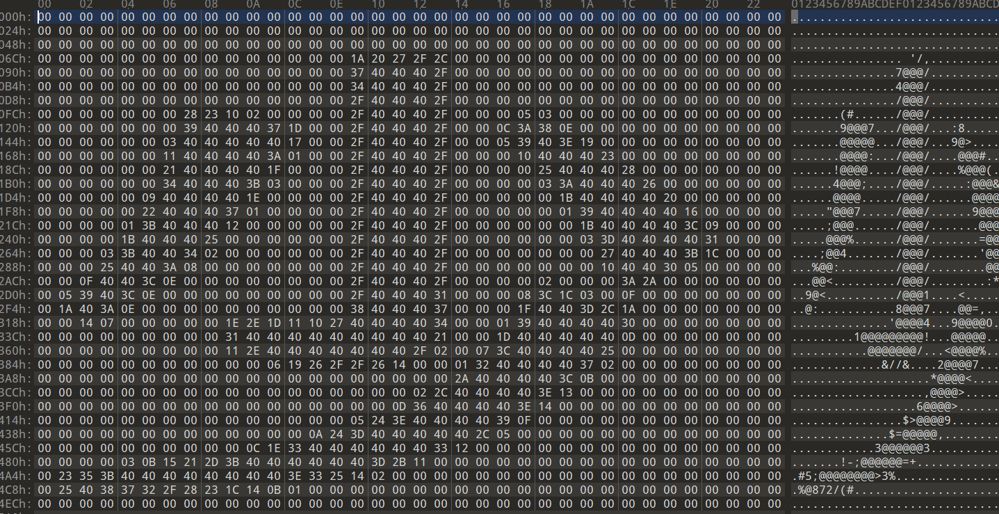  
本游戏取得字模后会用一个缩放因子缩放，约为原字模大小的0.72倍。游戏还会为取得的字母绘制一个边框，具体操作就不详述了

# TIPS显示
游戏TIPS的信息保存在csv.pac的TIPS.CSV中  
此游戏TIPS.CSV如下  
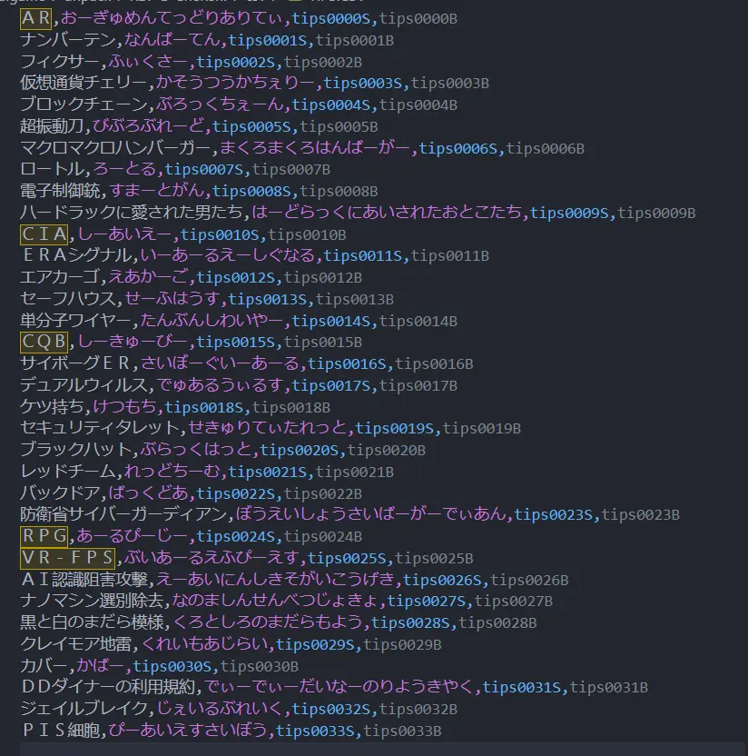  
每行的第2项为该条TIPS的注音信息，游戏会依据注音划分TIPS，如果直接修改文件编码，注音编码的变化会导致游戏无法正确检测注音，从而出现如下情况  
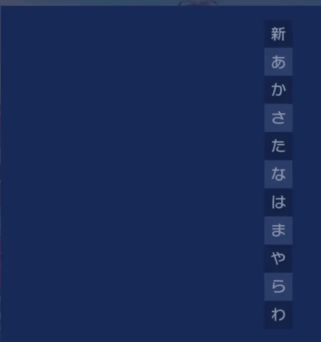  
所有按钮均失效  

修改有两种办法。  
1:是直接将注音的字符替换为中文编码下与其编码相同的字符，(如将"")比较简单，就是有点不好看  
2:修改注音字符判定，exe中搜索  
82 A0 82 A2 82 A4 82 A6 82 A8 82 A9 82 AB 82 AD

82 AF 82 B1 82 B3 82 B5 82 B7 82 B9 82 BB 82 BD

82 BF 82 C2 82 C4 82 C6 82 C8 82 C9 82 CA 82 CB

82 CC 82 CD 82 D0 82 D3 82 D6 82 D9 82 DC 82 DD

82 DE 82 DF 82 E0 82 E2 81 40 82 E4 81 40 82 E6

82 E7 82 E8 82 E9 82 EA 82 EB 82 ED 82 EE 82 EF

82 F0  
并修改其为中文编码，某些情况下可能还不够，具体需要查看vm的0x120052这一函数

